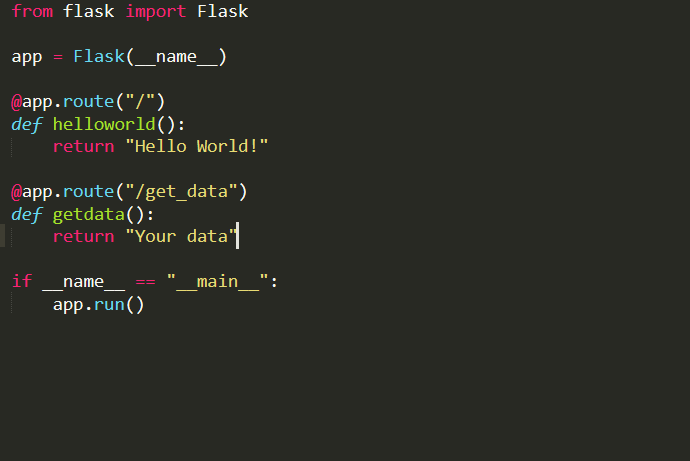
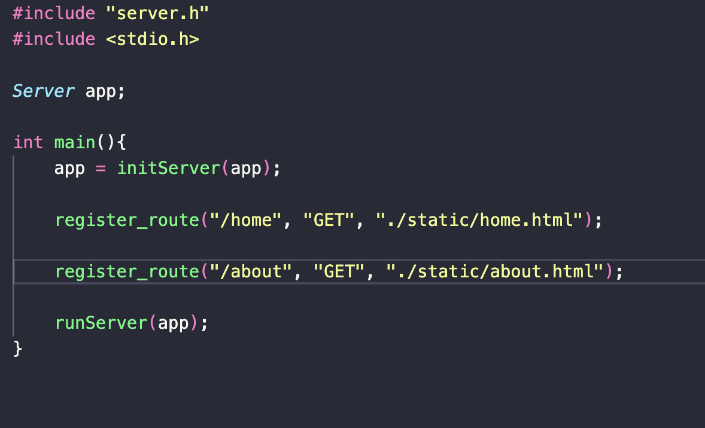

# Multithreaded HTTP Server in C

A minimal, multithreaded HTTP server built from scratch in C — featuring custom request parsing, routing, and static file serving. Inspired by the elegance of Flask, this project demystifies how backend frameworks actually work under the hood.

---

## Aim for this project 

I was learning flask first and then I wanted to know about it worked under the hood at least how its serving files on certain urls and requests. Therefore, I made it very similar to flask code.

This project helped me explore:
- How URL routing maps to files
- How HTTP requests are parsed at the byte level
- How multithreaded servers manage client connections

---

## Flask vs C 

| **Flask (Python)**               | **This Server (C)**                     |
|----------------------------------|------------------------------------------|
| `@app.route("/home")`            | `register_route("/home", "GET", ...)`   |
| `return render_template("...")`  | `get_html_from_file(...)`               |
| `app.run()`                      | `runServer(...)`                        |

      


---

## 🛠️ How to Run

```bash
git clone https://github.com/yourusername/httpServer.git
cd httpServer
make
./app
